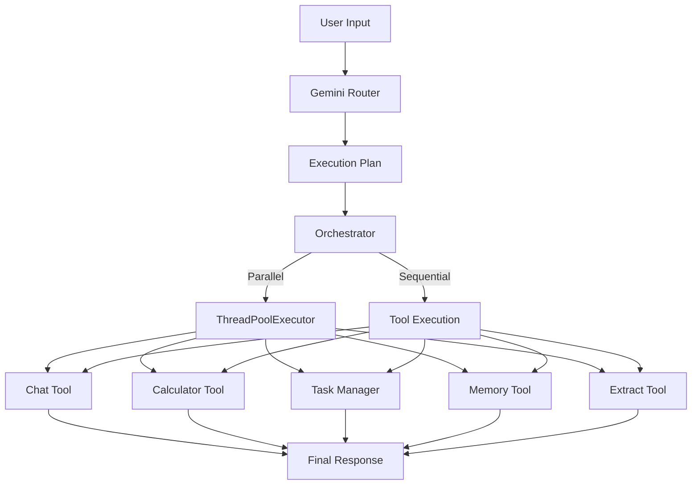

# 🤖 Mini AI Agent


A modular AI-powered assistant built with Python and Google's Gemini API.

This project demonstrates an AI agent capable of routing user requests to specialized tools, maintaining long-term memory, managing tasks, performing calculations, extracting structured information, and executing independent tasks in parallel.

---

# Features

- 💬 AI Chat
- 🧮 Calculator
- ✅ Task Manager
- 🧠 Long-Term Memory
- 📄 Information Extraction
- 🔀 AI Router
- ⚡ Parallel Tool Execution
- 📁 JSON-based Storage

---

# Project Architecture

```
User
   │
   ▼
Router (Gemini)
   │
   ▼
Execution Plan
   │
   ▼
Orchestrator
   │
   ├──────────────┐
   ▼              ▼
Calculator     Chat
Task Manager   Memory
Extract
```

---
## 🏗️ Architecture



# Folder Structure

```
Mini-AI-Agent/
│
├── agent/
│   ├── tools/
│   │   ├── calculator.py
│   │   ├── task_manager.py
│   │   ├── memory.py
│   │   ├── extract.py
│   │   ├── chat.py
│   │   └── __init__.py
│   │
│   ├── router.py
│   ├── orchestrator.py
│   ├── prompts.py
│   ├── gemini.py
│   └── context.py
│
├── data/
│   ├── memory.json
│   └── tasks.json
│
├── main.py
├── requirements.txt
└── README.md
```

---

# Technologies Used

- Python 3
- Google Gemini API
- ThreadPoolExecutor
- JSON
- Modular Architecture
- Prompt Engineering

---

# Tools

## Chat

Handles:

- Greetings
- Coding help
- General questions
- Explanations

Example:

```
Hi
```

---

## Calculator

Example:

```
Calculate (25+30)*4
```

Output:

```
220
```

---

## Task Manager

Supports:

- Add Task
- Show Tasks
- Complete Task
- Update Task
- Delete Task

Example:

```
Add task buy milk
```

---

## Memory

Stores user information.

Example:

```
Remember that my name is Mahaveer
```

Later:

```
What is my name?
```

---

## Extract

Extracts structured information.

Example:

```
Extract information from:

John lives in Surat.
Email: john@gmail.com
Phone: 9876543210
```

Returns structured JSON.

---

# Parallel Execution

The orchestrator automatically detects independent tasks.

Example:

```
Hi, calculate 20+30
```

Both Chat and Calculator execute simultaneously using `ThreadPoolExecutor`.

---

# Installation

Clone the repository

```
git clone <repository-url>
```

Install dependencies

```
pip install -r requirements.txt
```

Create a `.env` file

```
GEMINI_API_KEY=YOUR_API_KEY
```

Run

```
python main.py
```

---

# Future Improvements

- Voice Assistant
- Web Search Tool
- Weather Tool
- Email Tool
- File Summarization
- GUI Interface
- FastAPI Deployment

---

# Author

**Mahaveer Regar**

B.Tech Electronics & Communication Engineering

SVNIT Surat
